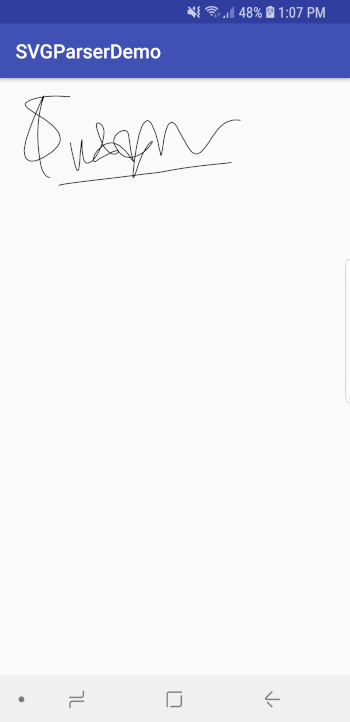

# SVGParserDemo
A very use case specific SVG parser and renderer.

## What is this library for?
This library originated as a necessity. We are using [Android SignaturePad](https://github.com/gcacace/android-signaturepad) library for our project. We needed to combine the captured signature with a pdf/image file(A4 scans). The problem was with the reduction in image resolution(sometimes upto 50x smaller). Because we are downsampling, the captured full screen image was very pixelated and useless. So instead of downsampling, we decided to draw the signature instead. This library takes the svg string and returns a bitmap for drawn for the particular size.

**Note:** Only the SVG returned by Android Signature pad library is currently supported and this library is intended for our specific use case though it can be extended.

## Usage
```
val rect = RectF(10f, 10f, 1000f, 1000f)
val bitmap = SVGHelper.getBitmap(this, svg, rect) // svg is the SVG as string
img_view.setImageBitmap(bitmap)
```



